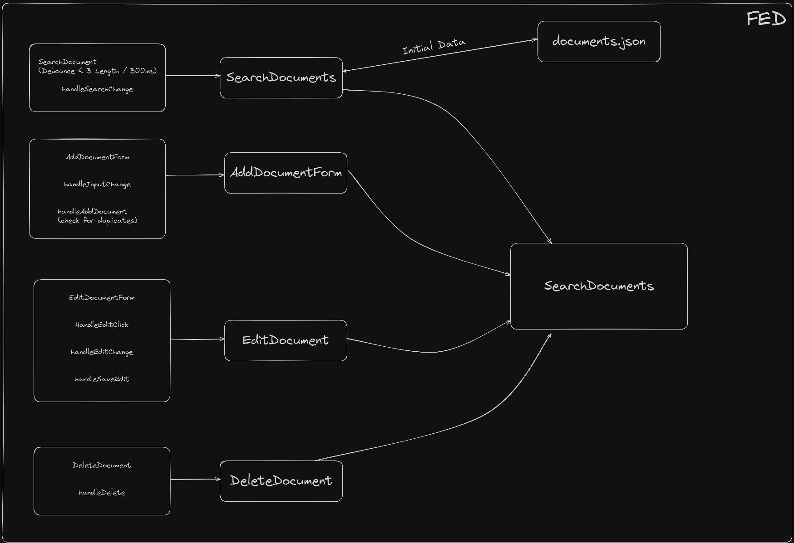

# Project Title

React Code Challenge

## Description

Create an react front end that will list out items in the Documents.json. Allow a user to add, edit, and delete items. 

Use React state to manage the data.

### Requirements

* Duplicate entries should not be allowed
* Ability to search document list by name
* Ability to add to document list
* Ability to edit a document item
* Ability to delete a document item

### Extra Credit

* Write tests for your components

This challenge is designed to be completed under 2 hours and is intended to see how you structure code and ensure you can follow specs. Our company values and respects the work/home separation so please don't spend a long time trying to solve the problem.

## Application Architecture

The application is divided into several key components, each responsible for handling specific functionality:

1. **SearchDocument**: Handles searching through documents, with a debounce that triggers after 3 characters or a 300ms delay. The search checks across all document fields (e.g., title, content, author, date, status).

2. **AddDocumentForm**: Manages the addition of new documents. The `handleAddDocument` function checks for duplicates before allowing a document to be added.

3. **EditDocumentForm**: Allows users to edit existing documents. It includes handlers for clicking the "Edit" button (`handleEditClick`), updating the input fields (`handleEditChange`), and saving the edits (`handleSaveEdit`).

4. **DeleteDocument**: Handles document deletion with the `handleDelete` function.

### Component Interaction

The flow of data is controlled by React state, passed as props between components. The following diagram illustrates the relationships between the components and how they interact with the initial data from `documents.json`:

- The **SearchDocuments** component fetches the initial data from `documents.json` and passes it to the other components for rendering, searching, editing, and deleting documents.
- The **AddDocumentForm**, **EditDocumentForm**, and **DeleteDocument** components work together to maintain the list of documents, ensuring that updates, deletions, and additions are reflected dynamically.

## Improvement Points
1. **Missing unit test**: While the components are well-structured and follow best practices, there is a lack of unit tests to ensure the functionality works as expected. Adding tests using Jest and React Testing Library would improve the reliability and maintainability of the codebase.
2. **Error handling**: The application currently lacks error handling for edge cases such as network failures, invalid data, or unexpected user inputs. Implementing error boundaries and validation checks would enhance the user experience and prevent crashes.
3. **Performance optimization**: The search functionality could be optimized further by implementing memoization or caching to reduce unnecessary re-renders and improve search speed. Additionally, lazy loading or pagination could be considered for large datasets to enhance performance.
4. **Accessibility**: Enhancing the accessibility of the application by adding ARIA attributes, keyboard navigation, and focus management would improve usability for users with disabilities and ensure compliance with accessibility standards.
5. **Responsive design**: The application layout could be made more responsive by using CSS media queries or a responsive design framework like Bootstrap to adapt to different screen sizes and devices.
6. **Code refactoring**: While the code is well-organized and readable, there are opportunities for refactoring to improve code quality, maintainability, and scalability. Extracting reusable components, reducing duplication, and adhering to consistent coding conventions would make the codebase more robust and easier to maintain.
7. **Localization**: Adding support for multiple languages and locales would make the application more accessible to a global audience and improve user engagement. Implementing internationalization libraries like react-intl would facilitate the localization process.
8. **State management**: Consider using a state management library like Redux or Context API for managing complex state interactions and sharing data between components. This would simplify data flow and make it easier to scale the application in the future.
9. **Security**: Implementing security best practices such as input validation, data sanitization, and protection against common vulnerabilities like XSS and CSRF would enhance the security of the application and protect user data from malicious attacks.
10. **Documentation**: Providing comprehensive documentation for the codebase, including inline comments, README files, and API references, would help developers understand the application's architecture, functionality, and usage. Clear documentation is essential for onboarding new team members and maintaining the codebase over time.

